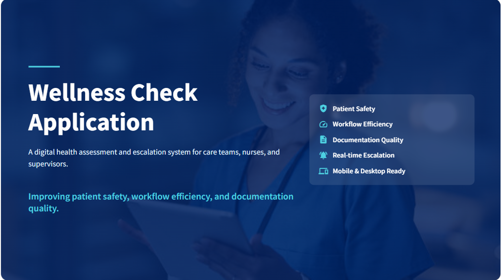

# 🩺 Wellness Check Application  
**Transforming Patient Wellness Assessments & Escalations Using Microsoft Power Platform**



---

## 🚀 Executive Summary

The **Wellness Check App** is a Microsoft Power Platform–based solution for healthcare teams to digitize patient assessments, escalate abnormal readings, and maintain audit-ready records. By replacing fragmented workflows with automated, centralized processes, the app reduces clinical risk, boosts operational efficiency, and improves regulatory compliance.

### Business Goals
- Digitize manual wellness checks
- Auto-escalate abnormal observations to supervisors
- Improve approval turnaround time
- Eliminate paper-based compliance risks

---

## 🔍 Problem Landscape

| Challenge                         | Operational Impact                                             |
|----------------------------------|----------------------------------------------------------------|
| Manual health assessments        | Inconsistent, error-prone data                                 |
| Slow escalation to supervisors   | Delays in responding to critical patient issues                |
| Disconnected communication       | Fragmented workflow (phone, email, paper)                      |
| No unified patient history       | Audit and decision-making complexity                           |
| Compliance gaps                  | Increased safeguarding and reporting risks                     |

> 🧨 These challenges contribute to burnout, missed risks, and avoidable clinical incidents.

---

## 💡 Solution Summary

The app integrates **Canvas Power Apps**, **Power Automate**, and **Azure SQL Server** into a single workflow:

- 🔄 Digital patient wellness checks (vitals, mood, medication)
- ⚠️ Escalation workflows triggered by rule thresholds
- 📨 Supervisor approvals via **Teams** or **Outlook**
- 🔒 Role-based access for nurses, carers, and admins
- 📱 Mobile and desktop compatible
- 📂 Secure, timestamped audit records

---

## 🧱 System Architecture

| Layer              | Technology               | Function                                        |
|-------------------|--------------------------|------------------------------------------------|
| Interface Layer    | Canvas Power App          | Used by frontline care staff and supervisors   |
| Workflow Engine    | Power Automate            | Escalation and approval automation             |
| Database Layer     | Azure SQL Server          | Central wellness data repository               |
| Communication Hub  | Microsoft Teams, Outlook  | Notification and action platforms              |
| Security Layer     | Role-Based Access Control | Data segmentation and policy enforcement       |

📷 **SQL Integration Overview**  


📷 **System Logic Flow**  


---

## 🔄 Functional Workflow

📷 **Patient Record Creation**  


1. **Nurse selects patient** from dashboard
2. **Reviews past assessments** and red flags
3. **Completes digital wellness check**: vitals, mood, meds
4. **System logs record** in SQL with timestamp
5. **Triggers escalation** if values exceed set thresholds
6. **Supervisor receives notification** via Teams or email
7. **Approves or rejects** from within message
8. **Status updates live** in the app

📷 **Live Approval Status**  


📷 **Escalation Email Example**  


---

## 🔁 Escalation & Communication Logic

📷 **Approval Flow Overview**  


📷 **Flow Logic Example**  


- If an abnormal value is recorded, the app triggers an **escalation request**
- Power Automate sends notification to the **assigned supervisor**
- Supervisors act from within **Teams or Outlook**
- Action is recorded and synced back into the app
- **Audit trail** is maintained for all escalation events

📷 **Approval Confirmation**  


---

## 🔐 Security & Compliance

| Category             | Measures Implemented                                       |
|----------------------|-------------------------------------------------------------|
| Data Security         | Azure SQL Server with encryption and row-level access       |
| Role Management       | Separate views for carers, supervisors, and admins          |
| Audit Trails          | All changes timestamped with user ID                        |
| Policy Enforcement    | Workflow gates based on clinical and operational policy     |

> 🔎 Built to align with **HIPAA**, **NHS DSP Toolkit**, and other healthcare standards.

---

## 📊 Measurable Business Impact

| Metric                        | Before                     | After                          | Outcome                     |
|------------------------------|----------------------------|--------------------------------|-----------------------------|
| Escalation Response Time     | 24–48 hours                | Under 8 hours                  | 70% faster                  |
| Documentation Accuracy       | Manual, inconsistent       | Digital, auto-timestamped      | 60% fewer errors            |
| Supervisor Response Rate     | Inconsistent               | 95% within SLA                 | Predictable & timely        |
| Admin Hours per Week         | ~10 hours                  | < 3 hours                      | 40+ hours saved weekly      |
| Paper Usage                  | Fully paper-based          | Fully digital                  | 100% eliminated             |

---

## 🧪 Technical Implementation

- **Platform**: Power Apps (Canvas) + Power Automate
- **Database**: Azure SQL Server
- **Cloud Flows**:
  - `WellnessCheck_Escalation_Trigger`
  - `Supervisor_Approval_Flow`
  - `Auto_Update_Patient_Status`
- **Testing**:
  - UAT with carers, supervisors, and admins
  - 100% success rate across use cases
- **Deployment**:
  - Packaged as Managed Solution ZIP
  - Easily portable across environments

📷 **Backend Schema**  


---

## 🔭 Product Roadmap

| Feature                       | Description                                | Timeline   |
|-------------------------------|--------------------------------------------|------------|
| Predictive Alerts (AI)        | Early detection of health deterioration    | Q1 2026    |
| Power BI Dashboards           | Data-driven executive reporting            | Q2 2026    |
| Voice-Assisted Entry          | Hands-free assessments                     | Q3 2026    |
| IoT Device Integration        | Wearable health data                       | Q4 2026    |
| Multi-Facility Deployment     | Scalable to group networks                 | 2027       |

---

## 📁 Repository Structure

```

📁 visuals/                     → UI screens, flows, and escalation visualizations
📁 Overall PDF Project Presentation/ → Project slide deck
📁 Solution Zip File/          → Managed Power Platform deployment package
📄 README.md                   → This file

```

---

## 📌 Conclusion

The **Wellness Check App** redefines clinical monitoring workflows by combining digital precision, intelligent automation, and real-time collaboration tools.

If your healthcare facility struggles with **slow escalations**, **manual processes**, or **audit challenges**, this solution delivers measurable impact across care quality, compliance, and staff productivity.

> 💬 Interested in deploying this in your care network? Let’s make it happen.

---

## 👤 Developed by

**Solomon Okpuno**  
Power Platform Consultant • Data & Workflow Automation Specialist  
🔗 [LinkedIn](https://linkedin.com/in/okpunosolomon)  
💻 [GitHub](https://github.com/okpunosolomon)

