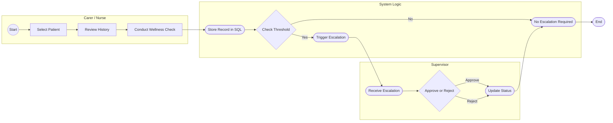

```mermaid
flowchart LR
    %% Define Swimlanes
    subgraph Carer / Nurse
        A1((Start))
        A2[Select Patient]
        A3[Review History]
        A4[Conduct Wellness Check]
    end

    subgraph System Logic
        B1([Store Record in SQL])
        B2{Check Threshold}
        B3([Trigger Escalation])
        B4([No Escalation Required])
    end

    subgraph Supervisor
        C1([Receive Escalation])
        C2{Approve or Reject}
        C3([Update Status])
    end

    %% Flows
    A1 --> A2
    A2 --> A3
    A3 --> A4
    A4 --> B1
    B1 --> B2
    B2 -- Yes --> B3
    B2 -- No --> B4
    B3 --> C1
    C1 --> C2
    C2 -- Approve --> C3
    C2 -- Reject --> C3
    C3 --> B4
    B4 --> End([End])
```
